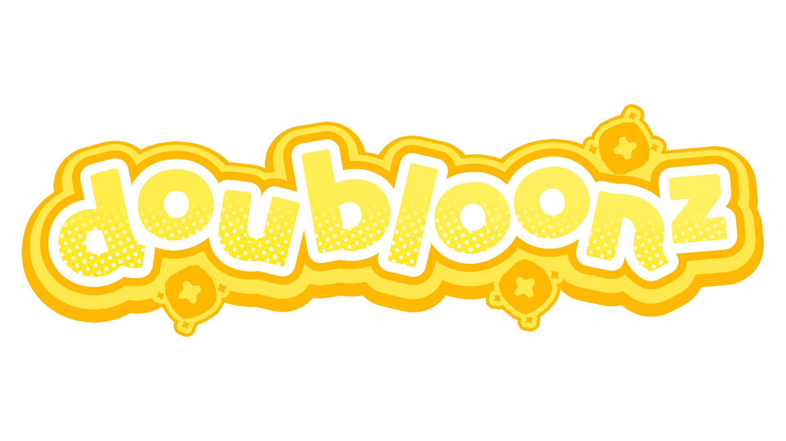

# Doubloonz

  

Doubloonz is a CLI tool that helps you determine when you'll be able to use your doubloons to purchase a prize from the doubloon shop. **Heavily** inspired by another project, [Doubloon Project Ranker](https://doubloon-project-ranker.vercel.app/).

The prizes within `prizes.json` include the prizes for the US (🇺🇸🦅) shop, so it might be slightly different for other regions.

I'm not personally a big fan of the [Go](https://golang.org/) programming language, but I really like the [Charm](https://github.com/charmbracelet) libraries for CLI tools. Go is kind of growing on me, though.

> [!WARNING]
> This project uses [nerd fonts](https://www.nerdfonts.com/). Make sure you have one installed to see the icons for doubloons

## Usage

1. Clone the repository
2. Run `go build` to build the binary
3. Run `./doubloonz` (or `./doubloonz.exe` on Windows) to start the CLI
